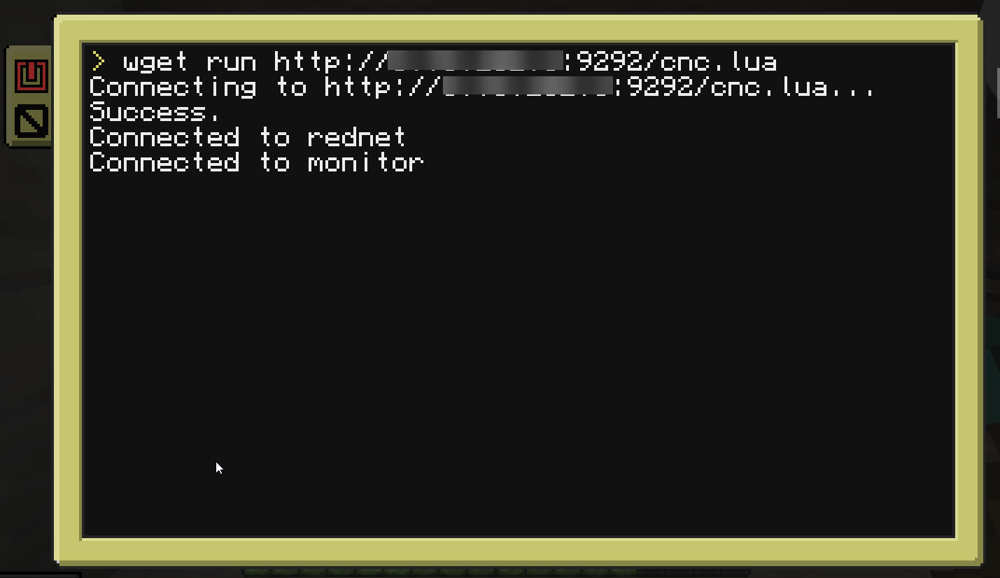
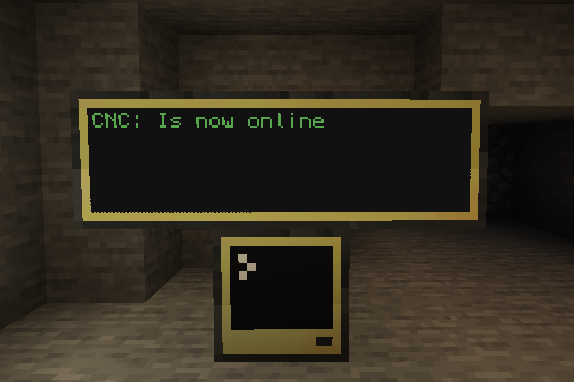

<figure>
  
  <figcaption>CNC - Front</figcaption>
</figure>

<figure>
  
  <figcaption>CNC - Back</figcaption>
</figure>

To setup the CNC machine run 

```
wget run http://[your server ip]:9292/cnc.lua
```

<figure>
  
  <figcaption>CNC - Terminal</figcaption>
</figure>

<figure>
  
  <figcaption>CNC - Online</figcaption>
</figure>